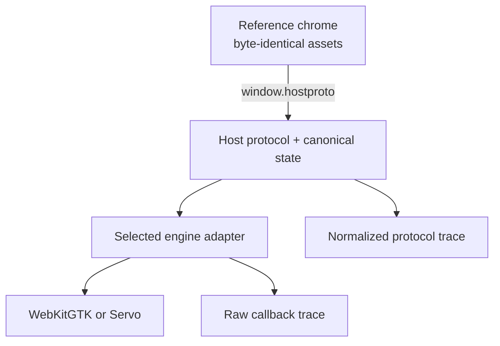

# hostproto

An engine-neutral browser-host contract, executable.

**Status:** pre-implementation research baseline  
**Package version:** 0.1.0  
**Fact-base date:** 2026-08-22

## Question

What is the smallest command, request, and event protocol sufficient for a frozen reference browser chrome, and where do WebKitGTK and Servo resist honest normalization?

The project succeeds in either direction:

- The same byte-identical chrome completes the declared scenario corpus through both engines.
- Or the evidence identifies exactly where the contract leaks, which semantics diverge, and why normalization would become dishonest.

A negative result is a result. The project does not require a redeeming browser at the end.

## Denominator

`REFERENCE_CHROME_V0.md` and `SCENARIO_CORPUS_V0.yaml` define what “sufficient” means. Nothing outside that corpus is implied by the word *browser*.

Minimality is tested against the corpus: a required protocol element earns its place only when removing it makes at least one declared scenario impossible or ambiguous.

## Architecture

The chrome has no engine detection, no direct WebKit or Servo calls, and no alternate build. Each run records the chrome bundle hash; equality is an evidence gate, not a screenshot claim.

The protocol is the public artifact. A Rust trait may implement it, but the trait is not the specification.

## Shipping boundaries

1. **Contract release:** frozen scenario corpus, protocol, capability model, schemas, mock adapter, and conformance runner.
2. **WebKitGTK evidence release:** adapter, raw and normalized traces, and classified findings.
3. **Servo evidence release:** second adapter behind the unchanged protocol, comparative traces, and classified findings.
4. **Upstream evidence release:** selected divergences reduced to minimal reproductions suitable for the relevant upstream project.

Each boundary is coherent alone. Each later trace adds a versioned observation. Old observations remain historical facts about pinned versions even when an engine changes underneath them.

## Permanent non-goals

- A browser intended for daily use.
- A general-purpose WebView abstraction.
- Widevine or other DRM integration.
- Sync, passwords, profile portability, persistent history, or session recovery.
- A WebExtension runtime or compatibility shim.
- Full DevTools or CDP compatibility.
- Sandbox hardening or production security claims.
- Performance competition between engines.
- Engine-specific behavior hidden to make traces agree.
- Renderer implementation work.

If a browser product later becomes desirable, it must be a separate downstream consumer of a released hostproto version. It does not become the next milestone here by administrative osmosis.

## Evidence rule

Every engine run retains both layers:

- **Raw trace:** callbacks and values as observed at the adapter boundary.
- **Normalized trace:** the protocol-visible requests, responses, events, state transitions, and suppressed raw observations.

Every divergence is classified as a semantic mismatch, unsupported capability, adapter defect, engine defect, fixture defect, or unresolved finding. “Something behaved strangely” is not yet evidence.

## Start here

1. Read `CHARTER.md` and `REFERENCE_CHROME_V0.md`.
2. Review the frozen scenarios in `SCENARIO_CORPUS_V0.yaml`.
3. Read `HOST_PROTOCOL_V0.md`, `CAPABILITY_MODEL.md`, and `TEMPORAL_AND_STATE_SEMANTICS.md`.
4. Execute Wave 0 from `DELIVERY_PLAN.md` without adding browser features.
5. Use `AGENT_PROMPTS.md` for implementation, assessment, and upstream-repro sessions.

No production code exists in this package. It is the bounded specification and work-generating substrate for the project.
