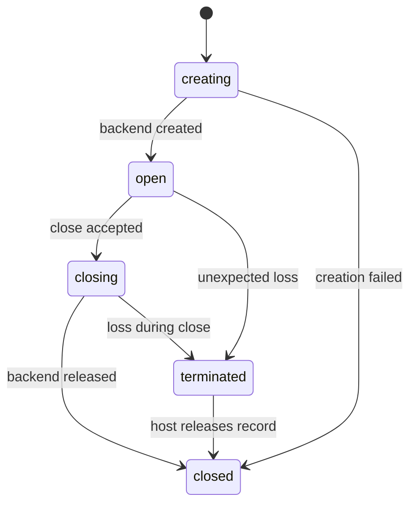

# Temporal and state semantics

The hard part of the contract is not naming methods. It is deciding what must happen before what, which side may wait, and when an observation has become too late to matter.

## Canonical reducer

The host core owns one deterministic reducer. Given the same initial state and normalized envelope sequence, it must produce byte-equivalent canonical state after removal of explicitly non-semantic fields such as timestamps.

Adapters cannot mutate canonical state directly. They submit raw observations; normalization emits protocol events; the reducer applies those events.

## Lifecycle

Rules:

- A view identifier is allocated once and never reused within a session.
- `closed` is terminal.
- `terminated` rejects operational commands but remains observable until the host releases it to `closed`.
- Events observed after `closed` remain in the raw trace and are suppressed from canonical mutation with a recorded reason.
- Exactly one open view may be active. No view may be active after it reaches `closing`, `closed`, or `terminated`.

## Navigation identity

Every accepted navigation operation gets a host-owned `navigation_id`. Backend callback identifiers may be absent or unstable and remain adapter-private.

An adapter maps raw observations to the currently attributable host navigation. If attribution is ambiguous, it emits a finding candidate rather than assigning the convenient identifier.

Terminal outcomes are:

- `success`
- `failed`
- `stopped`
- `superseded`

One navigation receives at most one terminal outcome. A later navigation may supersede an earlier in-flight navigation; the earlier attempt must not silently vanish.

## Ordering

hostproto defines partial order, not a globally identical callback sequence.

Required relations include:

- `welcome` before any accepted operational request.
- Successful `view.create` response after backend creation, and `view.created` no later than the next state snapshot.
- `navigation.started` before its terminal navigation event.
- `view.closing` before `view.closed` when close was host-initiated.
- `view.closed` before rejection of any later command for that view.
- `view.open_requested` before its resolution or expiry.

Incidental ordering between independent views is not a conformance oracle.

Every normalized event gets a host-assigned monotonic `seq`. Raw traces maintain an independent per-adapter ordinal. Timestamps are diagnostic only and cannot decide conformance unless a scenario explicitly tests a deadline.

## Exactly-once terminality

Every accepted request produces exactly one terminal response: success or error. Retries require new request identifiers.

The host may internally deduplicate a transport redelivery by request identifier, but the trace records the duplicate and the chosen response. It must not re-run a backend effect.

## Deadlines

- Request deadlines are interpreted by the host's monotonic clock.
- A deadline produces `deadline_exceeded`; it does not prove the backend effect did not occur.
- If an effect may have escaped after timeout, the response includes `outcome: unknown`, canonical state is reconciled, and a finding candidate is opened.
- `view.open_requested` uses a scenario-declared decision deadline and default `deny`.
- Wall-clock values are recorded for diagnostics; elapsed monotonic duration is authoritative within the run.

## Cancellation

Cancellation is best effort:

1. Caller sends `cancel` for an active request or invokes `navigation.stop` for a navigation.
2. Host records whether cancellation reached the responsible layer.
3. Original operation still receives exactly one terminal outcome.
4. Late success after accepted cancellation is legal only if the backend effect could not be recalled; it must be visible and reconciled rather than rewritten as cancellation.

## Re-entrancy

Adapters must not call chrome handlers synchronously while processing a chrome request. Raw callbacks are queued, normalized, sequenced, and delivered after the active request frame yields.

Host-originated decisions use `view.open_requested` plus a later `view.resolve_open_request`; they do not suspend an engine callback indefinitely. The adapter must define the backend-safe holding mechanism and default-deny deadline. If the backend requires a synchronous decision that cannot be bridged honestly, that is a semantic finding.

## Reconnect

A chrome-bridge reconnect creates a new bridge connection, not a new host session. After handshake:

1. Chrome calls `session.get_state`.
2. Host returns one authoritative snapshot with the latest event sequence.
3. Live events begin after that sequence.
4. Chrome discards any local projection not derivable from the snapshot and later events.

No persistent recovery is implied. Reconnect applies only while the host process and canonical session survive.

## Suppression

Normalization may suppress a raw observation only when:

- It is representational noise with no distinct protocol meaning.
- It duplicates an already emitted semantic event.
- It targets a terminal object and cannot change canonical state.
- Its backend meaning is unknown and surfacing it as a known event would be misleading.

Every suppression record contains raw trace reference, rule identifier, object identifiers if known, and reason. Suppression counts and categories appear in the evidence report. A normalization layer that merely throws inconvenient callbacks away has failed the assignment.
